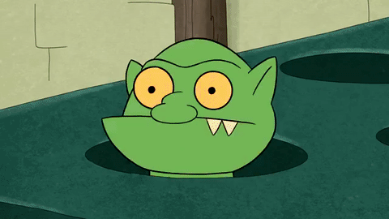
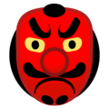

# Домашнее задание к занятию "3.Обработка событий"

#### Легенда

Вы решили доделать игру с гоблинами, поэтому нужно реализовать оставшуюся логику.



Copyright gfycat.com

#### Описание

Для картинки персонажа использовал следующую:



---
# Игра "Ударь гоблина" (со счётчиком)

[](https://github.com/Hirodropus/ahj-events/actions/workflows/web.yml)

**Ссылка на игру:** [https://hirodropus.github.io/ahj-events/](https://hirodropus.github.io/ahj-events/)

## Правила игры
- Гоблин появляется в случайной ячейке на **1 секунду**.
- Кликните по гоблину – получите **+1 балл**.
- Если пропустите **5 появлений** – игра заканчивается.


## Установка и запуск

```bash
yarn install
yarn start